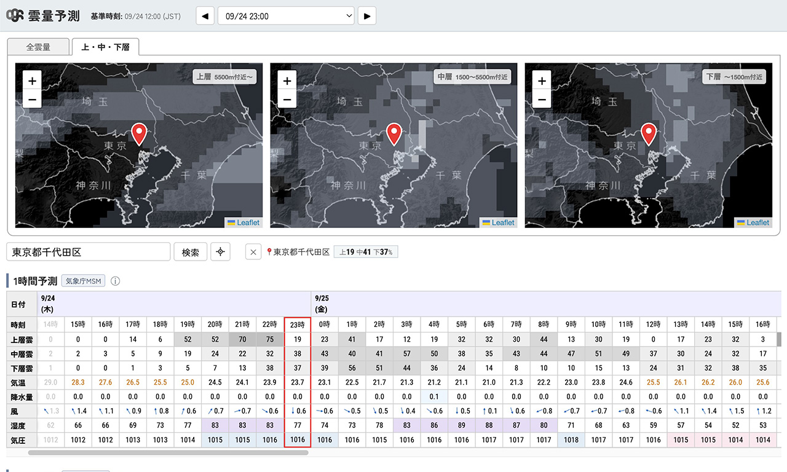
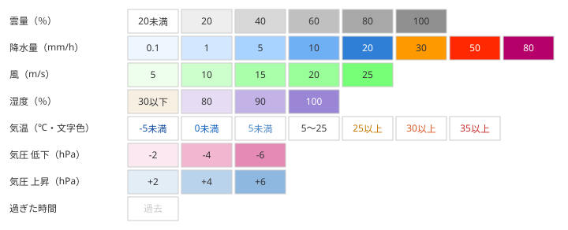

# 雲量予測 / Cloud Cover Forecast

お出かけするタイミングを決めるときに、 **雲がどれくらい出るか** と、 **その地点の気温・雨・風などの見通し** を1画面で確かめられるようにしたWEBアプリです。

**公開先: https://yager.github.io/cloud-cover-forecast/**

## できること

### 雲量の地図

上層・中層・下層の雲の量を、それぞれ別の地図に色分けして表示します（1枚にまとめた「全雲量」にも切り替えられます）。日本付近を約5kmの細かさで塗り分けており、時刻を送ると39〜78時間先まで1時間ごとに確認できます。

黒い地図の上に、雲が多いところほど白く濃く重なります。上層だけ曇っているのか、下層がべったり覆っているのかを見分けられます。

### 風の地図

地上10m付近の風を、矢印（向き）と面の色（強さ）で示します。雲量と同じ5km格子・同じ時刻を使うので、通信量は増えません。

矢印は間引いて表示しています（実在する格子点の一部をそのまま見せているだけで、間の値を作ってはいません）。地図が黒背景のため、配色は表の風（下記）とは違う寒色→暖色にしてあります。理由は[表の色の意味](#表の色の意味)を参照してください。

山の稜線付近では、5km格子の風は実際の風とかなり違うことがあります（地形が平滑化されているため）。

### 降水・雷の地図（気象庁ナウキャスト）

雲量・風とは別に、気象庁が配信している**高解像度降水ナウキャスト**と**雷ナウキャスト**をそのまま重ねて表示します。気象庁の観測・解析そのものなので、このサイトが数値を加工することはありません。

| | 中身 | 刻み | 範囲 |
|---|---|---|---|
| **降水** | レーダー観測（実況）と直近の予測 | 5分 | 直近1時間〜1時間先 |
| **雷** | 雷の活動度（面）と落雷地点（点） | 5〜10分 | 直近1時間〜1時間先 |

地図の下のタイムライン（横にドラッグ、または▶で再生）で時刻を送れます。雲量・風の時刻プルダウンとは別の時間軸なので、タブを切り替えるとコントロールごと入れ替わります。

ピンを立てると、タイムラインにその地点の降水強度・雷活動度の推移が帯で表示されます。

雷の活動度（1〜4）は気象庁の分類です。詳しくは[雷ナウキャストの見方](https://www.jma.go.jp/jma/kishou/know/toppuu/thunder2-2.html)（気象庁）を参照してください。

### 地点ごとの表

地図に**ピン**を立てると、その地点について3つの表が出ます。いずれも横が時刻、縦が項目（雲量・気温・降水量・風・湿度・気圧）の並びです。

| 画面上の名前 | 中身 | 刻み | 先まで |
|---|---|---|---|
| **1時間予測** | 気象庁のメソモデル（MSM）が計算した値 | 1時間 | 最大78時間 |
| **2週間予測** | ECMWF の AI モデル（AIFS）が計算した値 | 6時間 | 15日 |
| **週間予報** | 気象庁が発表している週間天気予報 | 1日 | 7日 |

上の2つは**数値予報モデルの計算結果**です。コンピュータが計算した値をそのまま並べたもので、気象庁や民間の気象会社が発表する「天気予報」とは別のものです（詳しくは[データと注意](#データと注意)）。一番下の週間予報だけが、気象庁の発表した予報そのものです。

このサイトでは、この違いが分かるように**モデルの計算結果を「予測」、気象庁の発表を「予報」**と呼び分けています。見出しの左の色帯とバッジの色も、この2種類で分けています。地図のタブの色帯（青灰＝雲量・風のモデル計算、緑灰＝降水・雷の気象庁ナウキャスト）も、同じ2色をそのまま使って語彙をそろえています。

## 使い方

| やりたいこと | 操作 |
|---|---|
| 表示する地図を変える | 地図の上のタブ（雲(全) / 雲(上中下層) / 風 / 降水 / 雷） |
| 雲量・風の時刻を変える | 上部のプルダウン、または ◀ ▶ |
| 降水・雷の時刻を変える | 地図の下のタイムライン。横にドラッグ、または▶で再生、⟳で現在時刻に戻る |
| 地図を大きく見る | 地図右下の四隅枠ボタン（もう一度押すか Esc で戻る） |
| ピンを立てる | PC は地図をクリック、スマホは長押し |
| 現在地にピンを立てる | 検索欄の横の十字ボタン |
| ピンを動かす | ピンをドラッグ |
| ピンを消す | 地図の下の「×」 |
| 地点を探す | 地図の下の検索欄（スマホは🔍） |
| 地点を保存する | ピンをタップして「登録」、または地点名の横の「登録」 |
| 保存した地点を開く | 地図上のグレーの丸をタップ（その地点にピンが立つ） |
| 保存した地点を直す・消す | グレーの丸またはピンをタップ → 編集 / 削除 |
| データの説明を見る | 各表の見出しの「ⓘ」 |

**現在地**

十字ボタンを押すと、GPS の位置にピンを立てます。パラメータの付いていない URL で開いたときは自動で取得します（断ってもかまいません。その場合は何も起きません）。

地点名は「現在地（東京都千代田区）」のように市区町村で表示します。海上や山頂の境界未定地域など、住所が分からない場所では緯度経度になります。

**保存した地点**

よく見る場所は地図上にグレーの丸として残しておけます。一覧画面はなく、地図上の丸だけが手がかりです。データはこの端末のブラウザ内にだけ保存され、サーバーへ送ることはありません（サイトのデータ削除や別ブラウザでは見えなくなります）。

**検索欄に入れられるもの**

- 地名・住所: `雲取山` `東京都千代田区` など。地図の中心から近い順に並びます
- 緯度経度: `35.68, 139.77` / `35°40'52"N 139°46'10"E` / `139.77 35.68`（順序が逆でも判定します）

**URL で共有できるもの**

| パラメータ | 意味 | 例 |
|---|---|---|
| `lat` `lng` `z` | 地図の中心とズーム | `?lat=35.85&lng=138.94&z=9` |
| `pin` | ピンの位置 | `?pin=35.85558,138.94393` |
| `pinname` | ピンの表示名 | `&pinname=雲取山` |

## 表の色の意味

数字の背景（気温だけは文字色）で、値の大きさや注意度を表しています。過ぎた時間帯は色を付けず、文字を薄くしています。

| 項目 | 区切り | 意味 |
|---|---|---|
| 雲量 | 20 / 40 / 60 / 80 / 100% | 区切りは地図と同じ。表は白背景なので、地図とは逆に多いほど濃い灰色 |
| 降水量 | 0.1 / 1 / 5 / 10 / 20 / 30 / 50 / 80 mm/h | 気象庁の「雨の強さと降り方」に対応。30mm（激しい雨）以上は青系から警戒色へ |
| 風 | 5 / 10 / 15 / 20 / 25 m/s | 強いほど濃い緑 |
| 湿度 | 30%以下 / 80 / 90 / 100% | 30%以下は乾燥（砂色）、80%以上は霧・雲海が出やすい側（藤色） |
| 気温 | -5 / 0 / 5 / 25 / 30 / 35℃ | 0℃は凍結、25/30/35℃は気象庁の夏日・真夏日・猛暑日 |
| 気圧 | 6時間で±2/4/6hPa、24時間で±5/8/12hPa | 気圧の変化が大きい時間帯（気圧痛の目安）。低下はピンク、上昇は青 |

気圧の色は、気圧の変化から機械的に付けた目安です。医学的な診断ではなく、感じ方には個人差があります。

**地図の色は、この表とは別の配色です。** 風・降水・雷の地図には、それぞれ左下に小さな凡例を出しています。とくに風は、表（白地に濃い緑）と地図（黒地に寒色→暖色）で見た目が違います。地図は黒背景なので、表と同じ緑の濃淡にすると強い風ほど背景に沈んでしまうためです。降水・雷の地図は気象庁が塗った色をそのまま使っています。

## データと注意

| 表示 | 出どころ | 種類 |
|---|---|---|
| 雲量・風の地図、1時間予測 | 気象庁メソモデル（MSM） | 数値予報モデルの**計算値** |
| 2週間予測 | ECMWF の AI モデル（AIFS） | 数値予報モデルの**計算値** |
| 週間予報 | 気象庁 | 気象庁が発表した**予報** |
| 降水の地図 | 気象庁（高解像度降水ナウキャスト） | 気象庁の観測・解析 |
| 雷の地図 | 気象庁（雷ナウキャスト） | 気象庁の観測・解析 |
| 地図・地名検索 | 国土地理院 | — |

- モデルの計算値は「**予測**」、気象庁が発表したものは「**予報**」と呼び分けています。計算値は加工せずそのまま表示していますが、大きな誤差を含むことがあります。
- 元データの配信は、計算の初期時刻から3.5〜5時間ほど遅れます（雲量・風・1時間予測・2週間予測）。降水・雷は気象庁が5〜10分ごとに更新しているものをそのまま使っています。

## ライセンス

コードは [MIT License](LICENSE) です。表示しているデータは提供元の条件に従います（[docs/data-sources.md](docs/data-sources.md)）。

- 1時間予測・2週間予測に使っている Open-Meteo の無料 API は**非商用利用に限られます**。商用で使う場合はデータの取り方を変える必要があります。

## 最後に

このWEBアプリは写真家である作者ヤガーがいち早く天気情報を把握するために開発されました。エンジニアらしく **ダッシュボード風に一度にたくさんの情報を把握できる** ことを目的としているため一般的なお天気アプリと同じ情報のはずなのに違って見えると思います。

完全無料で公開していますが、もしこのWEBアプリが気に入っていただけたら[note](https://note.com/yager/n/nd9c27bc763bd)からチップで寄付をしていただいたり、[@yager](https://x.com/yager)当てに応援メッセージをいただけると今後の開発の励みになります！

https://note.com/yager/n/nd9c27bc763bd