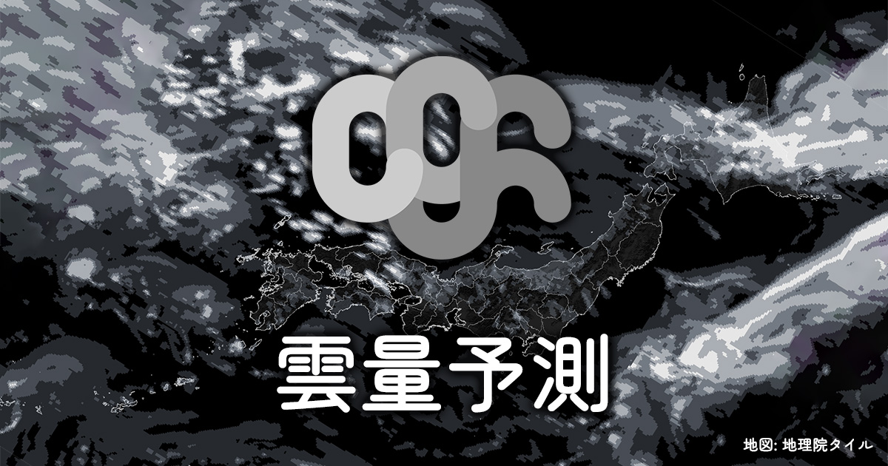
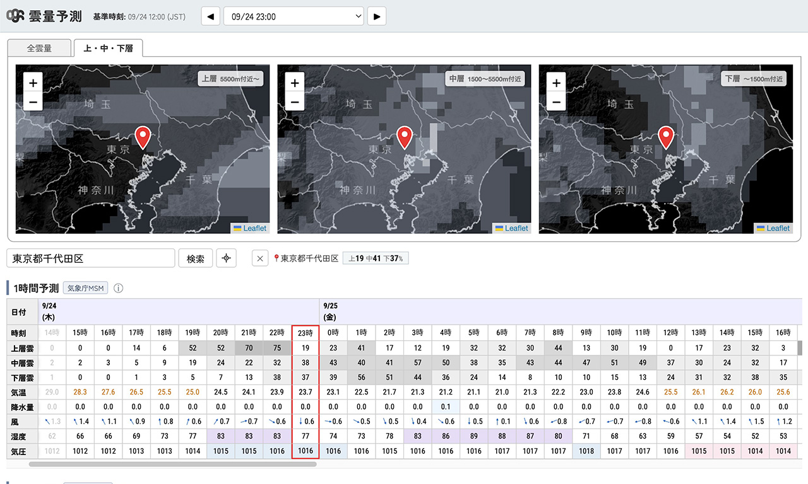
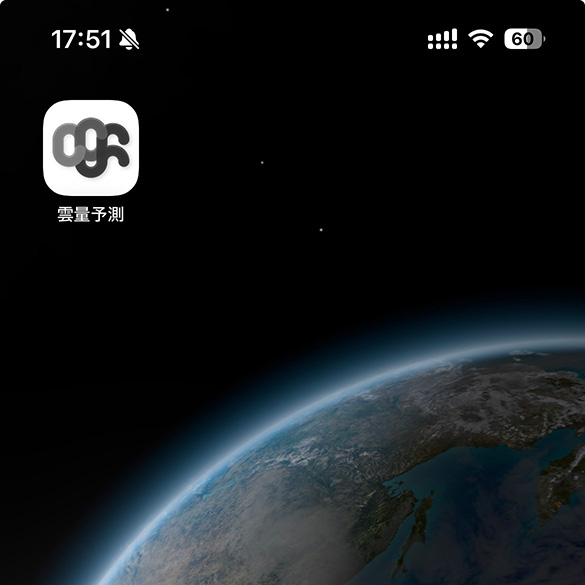
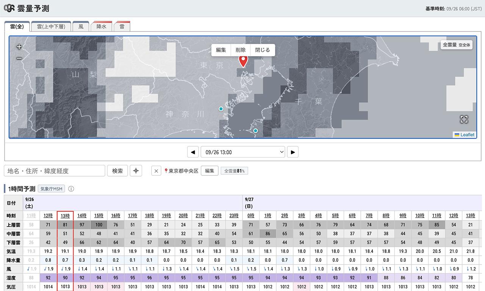
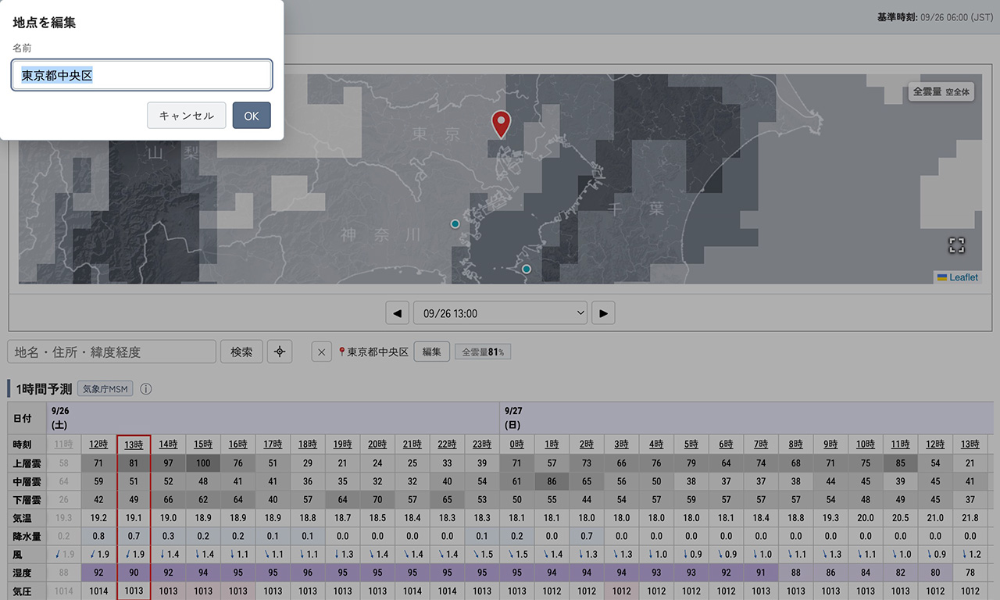
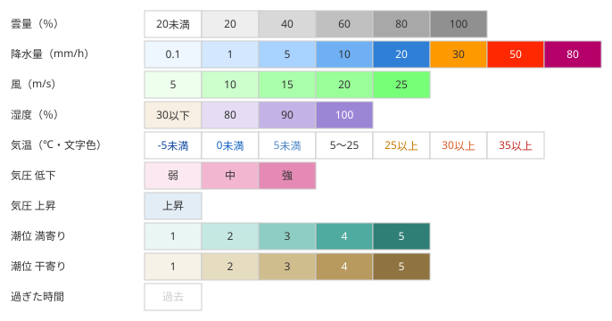

# 雲量予測 / Cloud Cover Forecast

お出かけするタイミングを決めるときに、 **雲がどれくらい出るか** と、 **その地点の気温・雨・風などの見通し** を1画面で確かめられるようにしたWEBアプリです。

**公開先: https://yager.github.io/cloud-cover-forecast/**

- 目次
  - [できること](#できること)
    - [雲量の地図](#雲量の地図)
    - [風の地図](#風の地図)
    - [降水・雷の地図（気象庁ナウキャスト）](#降水雷の地図気象庁ナウキャスト)
    - [地点ごとの表](#地点ごとの表)
  - [使い方](#使い方)
    - [インストールなしですぐに使えます](#インストールなしですぐに使えます)
    - [ホーム画面からアプリのように使う](#ホーム画面からアプリのように使う)
    - [画面の操作](#画面の操作)
  - [表の色の意味](#表の色の意味)
  - [データと注意](#データと注意)
  - [ライセンス](#ライセンス)
  - [最後に](#最後に)

　

## できること

### 雲量の地図

上層・中層・下層の雲の量を、それぞれ別の地図に色分けして表示します（1枚にまとめた「全雲量」にも切り替えられます）。日本付近を約5kmの細かさで塗り分けており、時刻を送ると39〜78時間先まで1時間ごとに確認できます。

黒い地図の上に、雲が多いところほど白く濃く重なります。上層だけ曇っているのか、下層がべったり覆っているのかを見分けられます。**全雲量**では、同じモデルの降水量を雲の上に半透明で重ねます（色は気象庁ナウキャストと同じ階級。左下に凡例）。タブ名は変えず、気象庁の「降水」タブ（レーダー）とは別物です。

### 風の地図

地上10m付近の風を、矢印（向き）と面の色（強さ）で示します。雲量と同じ5km格子・同じ時刻を使うので、通信量は増えません。

矢印は間引いて表示しています（実在する格子点の一部をそのまま見せているだけで、間の値を作ってはいません）。地図が黒背景のため、配色は表の風（下記）とは違う寒色→暖色にしてあります。理由は[表の色の意味](#表の色の意味)を参照してください。

山の稜線付近では、5km格子の風は実際の風とかなり違うことがあります（地形が平滑化されているため）。

### 降水・雷の地図（気象庁ナウキャスト）

雲量・風とは別に、気象庁が配信している**高解像度降水ナウキャスト**と**雷ナウキャスト**をそのまま重ねて表示します。気象庁の観測・解析そのものなので、このサイトが数値を加工することはありません。

| | 中身 | 刻み | 範囲 |
|---|---|---|---|
| **降水** | レーダー観測（実況）と直近の予測 | 5分 | 直近1時間〜1時間先 |
| **雷** | 雷の活動度（面）と落雷地点（点） | 5〜10分 | 直近1時間〜1時間先 |

地図の下のタイムライン（横にドラッグ、または▶で再生）で時刻を送れます。雲量・風の時刻プルダウンとは別の時間軸なので、タブを切り替えるとコントロールごと入れ替わります。

地図で地点を選ぶと、タイムラインにその地点の降水強度・雷活動度の推移が帯で表示されます。

雷の活動度（1〜4）は気象庁の分類です。詳しくは[雷ナウキャストの見方](https://www.jma.go.jp/jma/kishou/know/toppuu/thunder2-2.html)（気象庁）を参照してください。

### 地点ごとの表

地図で**地点を選ぶ**と、その地点について3つの表が出ます。いずれも横が時刻、縦が項目の並びです。1時間予測には雲量・気温・降水量・風・湿度・気圧に加え、**最寄りの潮位表掲載地点の潮位**（天文潮の推算、単位 cm）が一番下に付きます。地点名と距離は表下の脚注（`*1`）に出します。

| 画面上の名前 | 中身 | 刻み | 先まで |
|---|---|---|---|
| **1時間予測** | 気象庁のメソモデル（MSM）の計算値、および気象庁潮位表に基づく潮位 | 1時間 | 最大78時間（潮位は同期間の毎時値） |
| **2週間予測** | ECMWF の AI モデル（AIFS）が計算した値 | 6時間 | 15日 |
| **週間予報** | 気象庁が発表している週間天気予報 | 1日 | 7日 |

上の MSM・AIFS の気象項目は**数値予報モデルの計算結果**です。コンピュータが計算した値をそのまま並べたもので、気象庁や民間の気象会社が発表する「天気予報」とは別のものです（詳しくは[データと注意](#データと注意)）。潮位は数値予報ではなく、気象庁潮位表の**天文潮（推算）**です。一番下の週間予報だけが、気象庁の発表した予報そのものです。

このサイトでは、この違いが分かるように**モデルの計算結果を「予測」、気象庁の発表を「予報」**と呼び分けています。見出しの左の色帯とバッジの色も、この2種類で分けています。地図のタブの色帯（青灰＝雲量・風のモデル計算、緑灰＝降水・雷の気象庁ナウキャスト）も、同じ2色をそのまま使って語彙をそろえています。

　

## 使い方

### インストールなしですぐに使えます

雲量予測はWEBアプリなので、https://yager.github.io/cloud-cover-forecast/ にアクセスするだけですぐに使い始められます。PC・スマホ両対応で、ログインも不要です。アプリストアからのダウンロードはありません。上の「公開先」のリンクが、そのままアプリ本体です。

### ホーム画面からアプリのように使う

何度も開くなら、ホーム画面に置いておくと便利です。アプリストアには並びませんが、アイコンから単体で起動でき、ブラウザのタブを探さずに済みます。

- **iPhone:** Safari で上のページを開く → 共有ボタン →「ホーム画面に追加」→「追加」
- **Android:** Chrome で上のページを開く → メニュー（︙）→「ホーム画面に追加」または「アプリをインストール」

LINE や X などのアプリ内ブラウザでは追加できないことが多いです。その場合は Safari または Chrome で開き直してください。

 

### 画面の操作

地図上の地点選択だけ、画面にボタンが無い操作があります。**地図を約0.5秒長押し**すると、その位置が選択されます（短くクリックしても地点は変わりません。パン用です）。検索や現在地ボタンでも選べます。

| やりたいこと | 操作 |
|---|---|
| 表示する地図を変える | 地図の上のタブ（雲(全) / 雲(上中下層) / 風 / 降水 / 雷） |
| 雲量・風の時刻を変える | 上部のプルダウン、または ◀ ▶ |
| 降水・雷の時刻を変える | 地図の下のタイムライン。横にドラッグ、または▶で再生、⟳で現在時刻に戻る |
| 地図を大きく見る | 地図右下の四隅枠ボタン（もう一度押すか Esc で戻る） |
| 地点を選ぶ | **地図を長押し（約0.5秒）**。検索や現在地ボタンでも可 |
| 現在地を選ぶ | 検索欄の横の十字ボタン |
| 選択中の地点を移す | しずく型のマーカー（バルーン）をドラッグ |
| 選択を消す | 地図の下の「×」 |
| 地点を探す | 地図の下の検索欄（スマホは🔍） |
| 地点を保存する | 選択中のバルーンをタップして「登録」、または地点名の横の「登録」 |
| 保存した地点を開く | 地図上のシアンの丸をタップ（シアンのバルーンになる） |
| 保存した地点を直す・消す | 丸またはシアンのバルーンをタップ → 編集 / 削除 |
| データの説明を見る | 各表の見出しの「ⓘ」 |

**マーカーの色と形**

| 見た目 | 意味 |
|---|---|
|  赤のバルーン（しずく型） | いま選んでいる地点（まだ保存していない） |
|  シアンのバルーン | いま選んでいる地点（保存済み） |
|  シアンの丸 | 保存済みだが、いまは選んでいない |

**現在地**

十字ボタンを押すと、GPS の位置を選びます。パラメータの付いていない URL で開いたときは自動で取得します（断ってもかまいません。その場合は何も起きません）。

地点名は「現在地（東京都千代田区）」のように市区町村で表示します。海上や山頂の境界未定地域など、住所が分からない場所では緯度経度になります。

**保存した地点**

よく見る場所は地図上にシアンの丸として残しておけます。選ぶとシアンのバルーンになり、地点名の左も同じ色のバルーンになります。一覧画面はなく、地図上の丸だけが手がかりです。データはこの端末のブラウザ内にだけ保存され、サーバーへ送ることはありません（サイトのデータ削除や別ブラウザでは見えなくなります）。

**検索欄に入れられるもの**

- 地名・住所: `雲取山` `東京都千代田区` など。地図の中心から近い順に並びます
- 緯度経度: `35.68, 139.77` / `35°40'52"N 139°46'10"E` / `139.77 35.68`（順序が逆でも判定します）

**URL で共有できるもの**

| パラメータ | 意味 | 例 |
|---|---|---|
| `lat` `lng` `z` | 地図の中心とズーム | `?lat=35.85&lng=138.94&z=9` |
| `pin` | 選択地点の位置 | `?pin=35.85558,138.94393` |
| `pinname` | 選択地点の表示名 | `&pinname=雲取山` |

　

## 表の色の意味

数字の背景（気温だけは文字色）で、値の大きさや注意度を表しています。過ぎた時間帯は色を付けず、文字を薄くしています。

| 項目 | 区切り | 意味 |
|---|---|---|
| 雲量 | 20 / 40 / 60 / 80 / 100% | 区切りは地図と同じ。表は白背景なので、地図とは逆に多いほど濃い灰色 |
| 降水量 | 0.1 / 1 / 5 / 10 / 20 / 30 / 50 / 80 mm/h | 気象庁の「雨の強さと降り方」に対応。30mm（激しい雨）以上は青系から警戒色へ |
| 風 | 5 / 10 / 15 / 20 / 25 m/s | 強いほど濃い緑 |
| 湿度 | 30%以下 / 80 / 90 / 100% | 30%以下は乾燥（砂色）、80%以上は霧・雲海が出やすい側（藤色） |
| 気温 | -5 / 0 / 5 / 25 / 30 / 35℃ | 0℃は凍結、25/30/35℃は気象庁の夏日・真夏日・猛暑日 |
| 気圧 | 下降: 6時間で2/4/6hPa、24時間で5/8/12hPa、平年値より3/6/10hPa低い。上昇: 6時間で2hPaまたは24時間で5hPa以上 | 気圧痛の目安。下降は3段階のピンク、上昇は単色の青（下記） |
| 潮位 | 前後±6時間の局所相対（5段階）。中立は無色 | 満寄りはティール、干寄りはカーキ。山／谷の時間帯を色で読む（満干の時刻テキストは出さない） |

気圧の色は、気圧痛に関する複数の研究（片頭痛と気圧の関係を調べた臨床研究、数千人規模のビッグデータ解析、
既存研究をまとめたメタ分析）を踏まえた目安です。医学的な診断ではなく、感じ方には個人差があります。

- **下降だけ3段階で色を付けます。** 「6時間での急な下降」「24時間でのじわじわした下降」
  「その都道府県・月の平年気圧よりどれだけ低いか」の3つのうち、一番強く出たものを採用します。
  3つ目の「平年値との差」を入れているのは、大きな変化が無くても、季節の割に気圧が低い日は
  それだけで体調に出ることがあるためです（標準気圧1013hPaは国際的な固定基準値で、実際には
  夏と冬で平年の気圧が10hPa近く違うため、固定値との比較では見誤ります）。
- **上昇は単色の青だけにしてあります。** 上昇でも体調に出るという報告はありますが、下降ほど
  根拠が強くないため、段階を付けて警戒色にはしていません。色で下降・上昇の向きは分かるので、
  上昇が平気な方は青は無視してかまいません。
- **潮位**は気圧と同様、向きで色系統を分けます（満＝ティール、干＝カーキ）。値そのものの大小ではなく、前後約6時間のなかでの山／谷の位置で塗ります。1時間刻みのため、頂点付近で最濃色が2コマ続くことがあります（そのあいだにピークがある、という読み方で足ります）。

**地図の色は、この表とは別の配色です。** 風・降水・雷の地図には、それぞれ左下に小さな凡例を出しています。とくに風は、表（白地に濃い緑）と地図（黒地に寒色→暖色）で見た目が違います。地図は黒背景なので、表と同じ緑の濃淡にすると強い風ほど背景に沈んでしまうためです。降水・雷の地図は気象庁が塗った色をそのまま使っています。

　

## データと注意

| 表示 | 出どころ | 種類 |
|---|---|---|
| 雲量・風の地図、1時間予測（気象項目） | 気象庁メソモデル（MSM） | 数値予報モデルの**計算値** |
| 1時間予測の潮位 | 気象庁潮位表 | **天文潮の推算**（月・太陽の起潮力。数値予報ではない） |
| 2週間予測 | ECMWF の AI モデル（AIFS） | 数値予報モデルの**計算値** |
| 週間予報 | 気象庁 | 気象庁が発表した**予報** |
| 降水の地図 | 気象庁（高解像度降水ナウキャスト） | 気象庁の観測・解析 |
| 雷の地図 | 気象庁（雷ナウキャスト） | 気象庁の観測・解析 |
| 地図・地名検索 | 国土地理院 | — |

- モデルの計算値は「**予測**」、気象庁が発表したものは「**予報**」と呼び分けています。計算値は加工せずそのまま表示していますが、大きな誤差を含むことがあります。
- 潮位は最寄りの潮位表掲載地点の値です（脚注に地点名と距離）。航海用ではなく、気圧・風などの影響で実測とずれることがあります。詳しくは [docs/data-sources.md](docs/data-sources.md)。
- 元データの配信は、計算の初期時刻から3.5〜5時間ほど遅れます（雲量・風・1時間予測・2週間予測）。降水・雷は気象庁が5〜10分ごとに更新しているものをそのまま使っています。潮位表の同梱データは年次更新です。

　

## ライセンス

コードは [MIT License](LICENSE) です。表示しているデータは提供元の条件に従います（[docs/data-sources.md](docs/data-sources.md)）。

- 1時間予測・2週間予測に使っている Open-Meteo の無料 API は**非商用利用に限られます**。商用で使う場合はデータの取り方を変える必要があります。

　

## 最後に

このWEBアプリは写真家である作者ヤガーがいち早く天気情報を把握するために開発されました。エンジニアらしく **ダッシュボード風に一度にたくさんの情報を把握できる** ことを目的としているため一般的なお天気アプリと同じ情報のはずなのに違って見えると思います。

完全無料で公開していますが、もしこのWEBアプリが気に入っていただけたら[note](https://note.com/yager/n/nd9c27bc763bd)からチップで寄付をしていただいたり、[@yager](https://x.com/yager)当てに応援メッセージをいただけると今後の開発の励みになります！

https://note.com/yager/n/nd9c27bc763bd